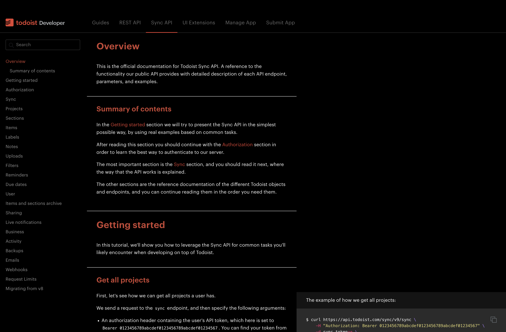

# Todoist Developer Dark (Stylish Theme)

This theme can be used by [Stylish](https://userstyles.org/)

https://github.com/igorleonovich/todoistdeveloper-dark-stylish/assets/8408481/2052b3ea-cfe8-4a79-b0be-8811c1e22403

### To Do:
* Darken scrollbar
